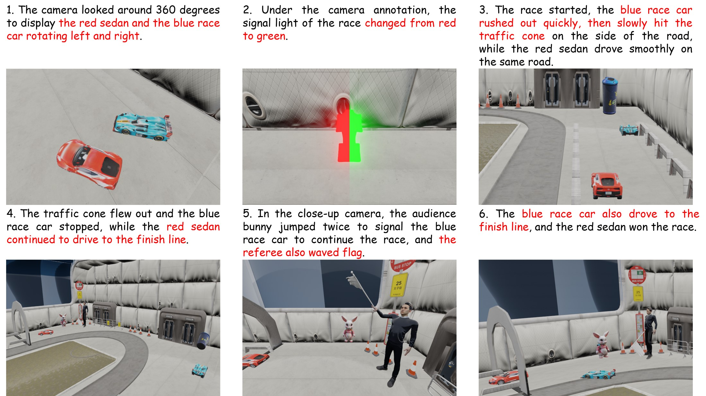

<!-- ## <div align="center"><b>PhotoMaker</b></div> -->
<p align="center">  </p>
<div align="center">
  
## Story3D-Agent: Exploring 3D Storytelling Visualization with Large Language Models
[[Paper](https://yuzhou914.github.io/Story3D-Agent/)]
[[Project Page](https://yuzhou914.github.io/Story3D-Agent/)]
[Demo] <be>
</div>

We are currently organizing the code for Story3D-Agent may bring as soon as possible.
If you are interested in our work, please star ⭐ our project. 
<br>


### Visualization of Story3D-Agent
**Story3D-Agent** is an innovative LLM-agents system designed for 3D storytelling visualization. The primary objective of the LLM-agents system is to adeptly transform a provided narrative into a corresponding 3D visualization. Below we illustrate the narrative titled *Race Day*, represented as a 3D-rendered representation.
<p align="center">
  
</p>


### Story3D-Agent Framework
<p align="center">
  
</p>


### Textual Self-check mechanism of Story3D-Agent
<p align="center">
  
</p>


### More result of Story3D-Agent
Below we illustrate the narrative titled *Friendship*, represented as a 3D-rendered representation.
<p align="center">
  
</p>


### Story continuation of Story3D-Agent
The continuation result for the narrative *Race Day* and *Friendship* is provided for illustration.
<p align="center">
  
</p>


<!-- ### Citation	
```
@article{huang2023smartedit,
  title={SmartEdit: Exploring Complex Instruction-based Image Editing with Multimodal Large Language Models},
  author={Huang, Yuzhou and Xie, Liangbin and Wang, Xintao and Yuan, Ziyang and Cun, Xiaodong and Ge, Yixiao and Zhou, Jiantao and Dong, Chao and Huang, Rui and Zhang, Ruimao and Shan, Ying},
  booktitle={arXiv preprint arxiv:2312.06739},
  year={2023}
}
``` -->
